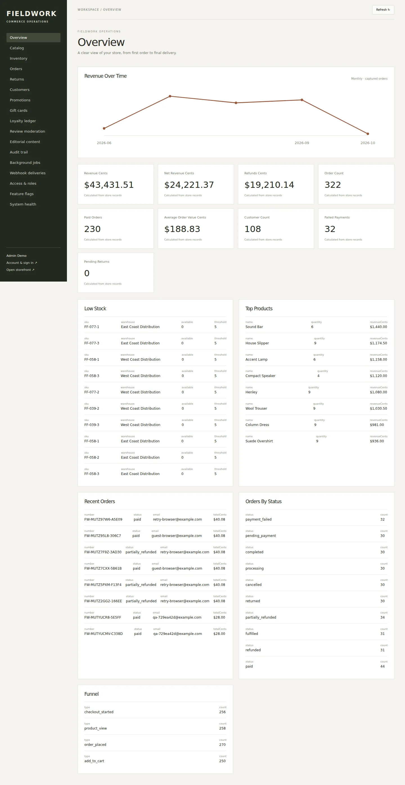
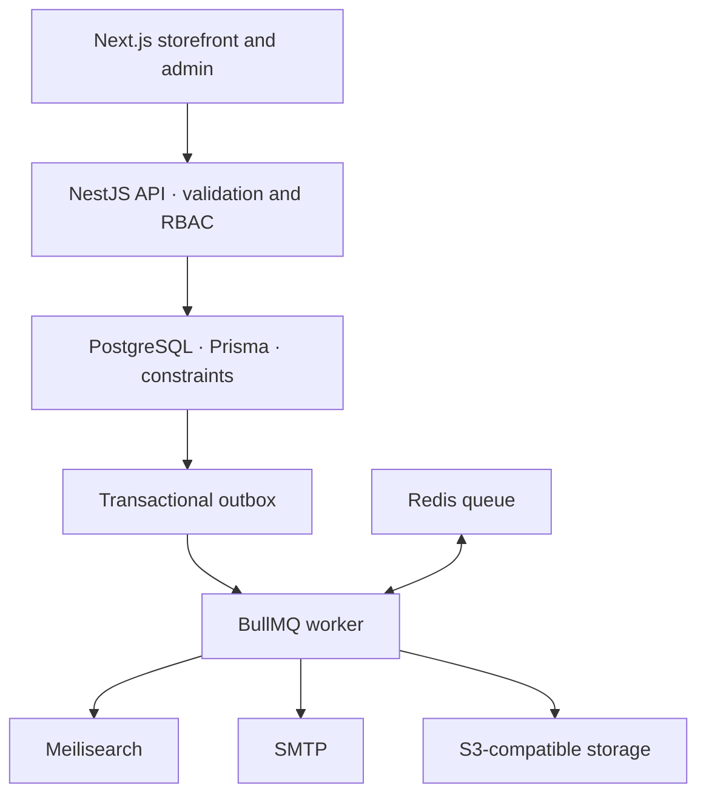

# FIELDWORK · Enterprise E-Commerce

A full-stack commerce application built by Salman: an editorial storefront, a permission-aware operations console, and a transactional commerce API. The interesting work is behind the checkout button—stock reservations, payment retries, gift-card allocation, refunds, and durable background events.

**Status:** runnable local portfolio project with deterministic mock payments. This is not a live shop. Production deployment and third-party service verification remain open; see [verification](docs/verification.md).

## Application




[Mobile screenshot](docs/screenshots/mobile.webp). These are actual local browser captures with fictional seeded data.

## What is implemented

- Product discovery, variants, filters, collections, comparison and recently viewed products.
- Persistent guest/customer carts, account registration/login, order history and token-protected guest tracking.
- Transactional checkout with integer-cent calculations, inventory row locks, immutable item snapshots, coupons and gift cards.
- Declined-payment recovery, scoped idempotency keys, authenticated webhook deduplication, partial fulfillment and proportional cash/gift refunds.
- Admin catalog/inventory/order tools, permissions, audit records, review moderation, content and operational job visibility.
- PostgreSQL outbox and BullMQ worker with email, search indexing, reservation expiry and bounded export handlers. External delivery requires the corresponding services.

## Architecture



PostgreSQL owns commerce truth. Redis queues work rather than owning inventory. Search indexes are derived and can be rebuilt. The modular monolith keeps transactions understandable and local development practical. There are 77 Prisma models, but schema presence alone is not a delivered feature.

| Package                 | Responsibility                                             |
| ----------------------- | ---------------------------------------------------------- |
| `apps/web`              | Next.js 16 / React 19 storefront and operations UI         |
| `apps/api`              | NestJS 12 API, authentication, checkout and administration |
| `apps/worker`           | Durable asynchronous side effects                          |
| `packages/database`     | Prisma 6 schema, SQL migrations and deterministic seed     |
| `packages/integrations` | SMTP, search, object storage and Stripe test adapters      |

Node 24, TypeScript, pnpm and Turborepo are used throughout. Tests use Vitest, Node's test runner and Playwright. Docker Compose provides local infrastructure.

## Run locally

Requirements: Node 24, pnpm 11.25 and Docker Compose. An 8 GB laptop can run application processes on the host; stop optional search/storage services when working only on checkout.

```bash
cp .env.example .env
pnpm install --frozen-lockfile
# Bash: load the example configuration before database commands.
set -a
source .env
set +a
docker compose -f docker/compose.yml up -d
pnpm db:generate
pnpm db:migrate
pnpm db:seed
pnpm dev
```

Open http://localhost:3000, API docs at http://localhost:4000/docs and Mailpit at http://localhost:8025. MinIO needs a private bucket named `commerce-media` created through its local console before storage jobs can succeed. See [local development](docs/local-development.md) and [integrations](docs/integrations.md).

The seed refuses production mode and a populated catalog. Its measured output is **120 products, 360 variants, 104 users, 300 orders, 250 reviews and 720 inventory rows**. This is fictional demo commerce data, not real sales or a scale benchmark.

| Role             | Email                | Local demo password |
| ---------------- | -------------------- | ------------------- |
| Customer         | customer@example.com | DemoCustomer!2026   |
| Administrator    | admin@example.com    | DemoAdmin!2026      |
| Operations       | ops@example.com      | DemoOps!2026        |
| Read-only viewer | viewer@example.com   | DemoViewer!2026     |

Demo accounts must not be deployed publicly without additional controls. The payment selector deliberately supports success and decline. No real card data is collected or charged.

## Verification

```bash
pnpm typecheck
pnpm lint
pnpm test
pnpm build
# API running against a separate disposable seeded database:
QA_ALLOW_MUTATION=true QA_API_URL=http://localhost:4000/api/v1 \
  node --import tsx scripts/qa-api.ts
pnpm exec playwright install chromium
pnpm test:e2e
```

The local API suite passed **57 assertions** over real HTTP and an embedded PostgreSQL engine. It covers ownership, retry, coupon exhaustion, stock contention, signed duplicate webhooks, fulfillment limits and exact split refunds. Embedded PostgreSQL serializes backend connections; this is not proof of production PostgreSQL concurrency performance. All **six Playwright browser flows passed** locally using Chromium headless shell. Native PostgreSQL integration is configured in CI. [Verification details and remaining work](docs/verification.md) distinguish executed checks from pending ones.

## Engineering decisions

- Money is stored as integer cents, never floating-point currency. Business rules are deterministic demo tax/shipping rules.
- Checkout locks stock and commits reservations, payments, snapshots and outbox events in a database transaction. Retries validate ownership before returning prior results.
- Idempotency keys are scoped and request-bound. Provider event IDs are unique; JSON field order cannot change duplicate detection.
- Refund allocations use cumulative proportional rounding so partial refunds sum to the exact original cash/gift tender. Credit restoration is part of the transaction.
- Passwords use Argon2id; session tokens are hashed, cookies are HttpOnly, mutations validate browser origin, and admin permissions are checked server-side.
- Background delivery is at least once. SMTP can duplicate during a crash window; a database log reduces normal retries but is not a promise of exactly-once email.

## Documentation and limitations

[Architecture](docs/architecture.md) · [Database](packages/database/README.md) · [Admin](docs/admin.md) · [Integrations](docs/integrations.md) · [Asset attribution](docs/assets.md) · [Verification](docs/verification.md)

Stripe is a test adapter, not a wired or verified live-payment checkout. Distributed API rate limiting, production caching, media quarantine, comprehensive accessibility auditing, tax/carrier integrations and real hosting remain follow-up work. Meilisearch indexing is implemented; storefront discovery currently uses PostgreSQL queries. There is no hosted demo URL yet. No benchmark or revenue result is claimed.

Original code is MIT licensed. Editorial photographs retain their upstream licenses and attribution; see `docs/assets.md`.
